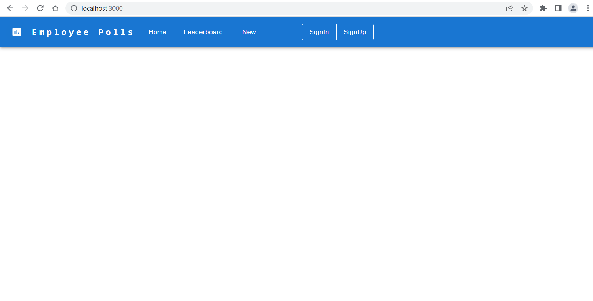
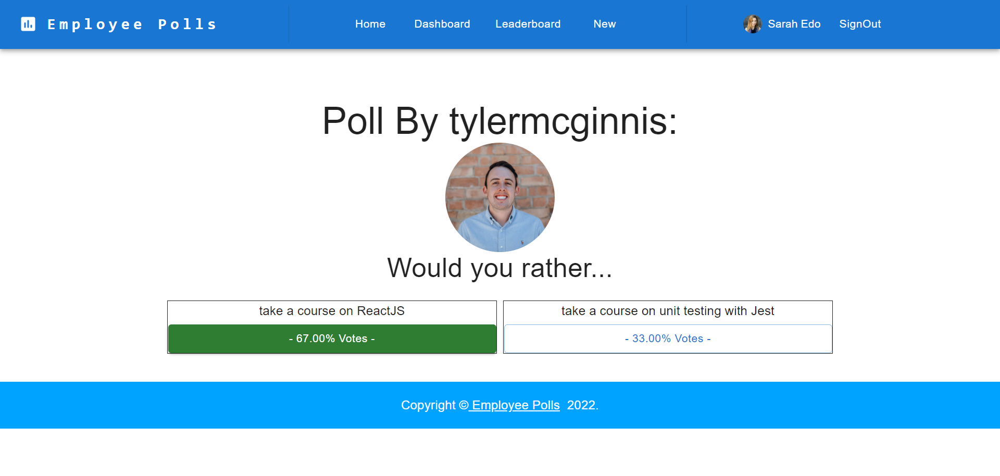

# 4 Months Software Engineer For Shell Scholarship Nanodegree Program

My pledge "60 Days of Udacity" for the Software Engineer for Shell Scholarship Nanodegree Program: https://classroom.udacity.com/nanodegrees/nd081-shell. The classroom starts from 24th June 2022 and will End in 24th Oct 2022.

My pledge "#60DaysofUdacity " with Udacity.
## Day 1: June 27, 2022. #60DaysofUdacity
- I entered the classroom and watched some videos.
- My current progress is:\
  **2. Backend Development with Node.js** (Progress 43%)\
	- **Lesson 1 - Foundations with Backend Development** (Progress 100%)\
	- **Lesson 2 - Getting Started with Node.Js** (Progress 100%)\
	- **Lesson 3 - Developing with TypeScript** (Progress 37%)\
- I will encourage @Vamsi Krishna P and @Shreya Agrawal.

## Day 2: June 28, 2022. #60DaysofUdacity
- My current progress is:\
  **2. Backend Development with Node.js** (Progress 55%)\
	- **Lesson 3 - Developing with TypeScript** (Progress 100%)\
- Tomorrow, I will try ro complete Unit Testing with Jasmine.
- I will encourage @Sandipan Dey and @Prabhakar.

## Day 3: June 29, 2022. #60DaysofUdacity
- My current progress is:\
  **2. Backend Development with Node.js** (Progress 58%)\
	- **Lesson 4 - Unit Testing with Jasmine** (Progress 40%)\
- Tomorrow, I will try ro complete Unit Testing with Jasmine.
- I will encourage @Nupur Chauhan and @Bhabani Prasad Kar.

## Day 4: June 30, 2022. #60DaysofUdacity
- My current progress is:\
  **2. Backend Development with Node.js** (Progress 76%)\
	- **Lesson 4 - Unit Testing with Jasmine** (Progress 100%)\
- Tomorrow, I will start to learn and try to complete Building a Server.
- There is one blocker issue with desc "Cannot find module 'jasmine-spec-reporter'. Did you mean to set the 'moduleResolution' option to 'node', or to add aliases to the 'paths' option?ts(2792)
" which need to resolve in local but working fine in workspace.
- I will encourage @Sushant.Magoo and @james mascarenhas.

## Day 5: July 01, 2022. #60DaysofUdacity
- My current progress is:\
  **2. Backend Development with Node.js** (Progress 97%)\
	- **Lesson 5 - Building a Server** (Progress 100%)\
- Tomorrow, I will start Impage Processing Project and try to complete within 2 days.
- Hurdles: I am not able to use node in my local for most of the npm pachage.
- I will encourage @Anindya Mahanty, @Suman.Palavalli, @Nupur Chauhan, @Bhabani Prasad Kar, @Vamsi Krishna P, @Shreya Agrawal, @Sushant.Magoo and @james mascarenhas.

## Day 6: July 02, 2022. #60DaysofUdacity
- My current progress is:\
  **2. Backend Development with Node.js** (Progress 97%)\
	- **Lesson 5 - Impage Processing Project** (Progress 20%)\
- Tomorrow, I will continue project Image Processing.
- Hurdles: I am not able to use node in my local for most of the npm pachage.
- I will encourage @Anindya Mahanty, @Suman.Palavalli, @Nupur Chauhan, @Bhabani Prasad Kar, @Vamsi Krishna P, @Shreya Agrawal, @Sushant.Magoo and @james mascarenhas.
					@vipin rawat, @Muhammed firoz

## Off-Day: July 03, 2022. #60DaysofUdacity

## Day 7: July 04, 2022. #60DaysofUdacity
- My current progress is:\
  **2. Backend Development with Node.js** (Progress 97%)\
	- **Lesson 5 - Impage Processing Project** (Progress 50%)\
	- Added dependencies and read about JavaScript Style Guide\
- Tomorrow, I will continue project Image Processing.
- Hurdles: Same issue
- I will encourage @Anindya Mahanty, @Suman.Palavalli, @Nupur Chauhan, @Bhabani Prasad Kar, @Vamsi Krishna P, @Shreya Agrawal, @Sushant.Magoo and @james mascarenhas.
					@vipin rawat, @Muhammed firoz

## Day 8: July 05, 2022. #60DaysofUdacity
- My current progress is:\
  **2. Backend Development with Node.js** (Progress 97%)\
	- **Lesson 5 - Image Processing Project** (Progress 70%)\
	- Added rest api to resize image and verify resizing feature\
- Tomorrow, I will continue project Image Processing.
- Hurdles: Same issue
- I will encourage @Anindya Mahanty, @Suman.Palavalli, @Nupur Chauhan, @Bhabani Prasad Kar, @Vamsi Krishna P, @Shreya Agrawal, @Sushant.Magoo and @james mascarenhas.
					@vipin rawat, @Muhammed firoz

## Day 9: July 06, 2022. #60DaysofUdacity
- My current progress is:\
  **2. Backend Development with Node.js** (Progress 97%)\
	- **Lesson 5 - Image Processing Project** (Progress 80%)\
	- Trying to implement logging in log file with default pattern\
- Tomorrow, I will continue project Image Processing.
- Hurdles: Same issue
- I will encourage @Anindya Mahanty, @Suman.Palavalli, @Nupur Chauhan, @Bhabani Prasad Kar, @Vamsi Krishna P, @Shreya Agrawal, @Sushant.Magoo and @james mascarenhas.
					@vipin rawat, @Muhammed firoz @Ranadeep Ghosh @Yashvendra Singh

## Day 10: July 07, 2022. #60DaysofUdacity
- My current progress is:\
  **2. Backend Development with Node.js** (Progress 97%)\
	- **Lesson 5 - Image Processing Project** (Progress 85%)\
	- Study and check doc of Sharp package.\
- Tomorrow, I will continue project Image Processing.
- Hurdles: Same issue
- I will encourage @Anindya Mahanty, @Suman.Palavalli, @Nupur Chauhan, @Bhabani Prasad Kar, @Vamsi Krishna P, @Shreya Agrawal, @Sushant.Magoo , @james mascarenhas, @vipin rawat, @Muhammed firoz @Ranadeep Ghosh @Yashvendra Singh, @Raghu @Naveen Kumar 

## Day 11: July 08, 2022. #60DaysofUdacity
- My current progress is:\
  **2. Backend Development with Node.js** (Progress 97%)\
	- **Lesson 5 - Image Processing Project** (Progress 85%)\
	- Study and check Prettier and Lint package.\
- Tomorrow, I will continue project Image Processing.
- Hurdles: Same issue
- I will encourage @Anindya Mahanty, @Suman.Palavalli, @Nupur Chauhan, @Bhabani Prasad Kar, @Vamsi Krishna P, @Shreya Agrawal, @Sushant.Magoo , @james mascarenhas, @vipin rawat, @Muhammed firoz @Ranadeep Ghosh @Yashvendra Singh, @Raghu @Naveen Kumar 

## Day 12: July 09, 2022. #60DaysofUdacity
- My current progress is:\
  **2. Backend Development with Node.js** (Progress 97%)\
	- **Lesson 5 - Image Processing Project** (Progress 90%)\
	- Code improvement and refactor for making it production ready code.\
- Tomorrow, I will continue project Image Processing.
- Hurdles: Same issue
- I will encourage @Anindya Mahanty, @Suman.Palavalli, @Nupur Chauhan, @Bhabani Prasad Kar, @Vamsi Krishna P, @Shreya Agrawal, @Sushant.Magoo , @james mascarenhas, @vipin rawat, @Muhammed firoz @Ranadeep Ghosh @Yashvendra Singh, @Raghu @Naveen Kumar 

## Day 13: July 10, 2022. #60DaysofUdacity
- My current progress is:\
  **2. Backend Development with Node.js** (Progress 97%)\
	- **Lesson 5 - Image Processing Project** (Progress 90%)\
	- Overall Project is completed and ready to submit\
- Tomorrow, I will submit project Image Processing and will treat myself.
- Hurdles: Same issue
- I will encourage @Anindya Mahanty, @Suman.Palavalli, @Nupur Chauhan, @Bhabani Prasad Kar, @Vamsi Krishna P, @Shreya Agrawal, @Sushant.Magoo , @james mascarenhas, @vipin rawat, @Muhammed firoz @Ranadeep Ghosh @Yashvendra Singh, @Raghu @Naveen Kumar 

## Day 14: July 11, 2022. #60DaysofUdacity
- My current progress is:\
  **2. Backend Development with Node.js** (Progress 97%)\
	- **Lesson 5 - Image Processing Project** (Progress 90%)\
	- Project was completed but due to some minor code changes eslint stop working so fixed that issue and improve Readme.MD file and commite to Git Repo.\
- Tomorrow, I will submit project Image Processing if everything thing will work as expected.
- Hurdles: Same issue
- I will encourage @Anindya Mahanty, @Suman.Palavalli, @Nupur Chauhan, @Bhabani Prasad Kar, @Vamsi Krishna P, @Shreya Agrawal, @Sushant.Magoo , @james mascarenhas, @vipin rawat, @Muhammed firoz @Ranadeep Ghosh @Yashvendra Singh, @Raghu @Naveen Kumar 

## Day 15: July 12, 2022. #60DaysofUdacity
- My current progress is:\
  **2. Backend Development with Node.js** (Progress 100%)\
	- **Lesson 5 - Image Processing Project** (Progress 95%)\
	- Project is completed.\
- Tomorrow, I will re-review project Image Processing and submit.
- Hurdles: None
- I will encourage @Anindya Mahanty, @Suman.Palavalli, @Nupur Chauhan, @Bhabani Prasad Kar, @Vamsi Krishna P, @Shreya Agrawal, @Sushant.Magoo , @james mascarenhas, @vipin rawat, @Muhammed firoz @Ranadeep Ghosh @Yashvendra Singh, @Raghu @Naveen Kumar 

## Day 16: July 13, 2022. #60DaysofUdacity
- My current progress is:\
  **2. Backend Development with Node.js** (Progress 100%)\
	- **Lesson 5 - Image Processing Project** (Progress 100%)\
	- Project is completed and submitted as well as reviewed.\
- Tomorrow, I will start React and Redux related lesson.
- Hurdles: None
- I will encourage @Anindya Mahanty, @Suman.Palavalli, @Nupur Chauhan, @Bhabani Prasad Kar, @Vamsi Krishna P, @Shreya Agrawal, @Sushant.Magoo, @james mascarenhas, @vipin rawat, @Muhammed firoz @Ranadeep Ghosh @Yashvendra Singh, @Raghu @Naveen Kumar @suhas murthy @Biraj Poddar @Nupur Chauhan 

## Day 17: July 14, 2022. #60DaysofUdacity
- My current progress is:\
  **3. React and Redux** (Progress 41%)\
	- **Lesson 1 - Introduction to the course** (Progress 100%)\
	- **Lesson 2 - Managing state** (Progress 100%)\
- Tomorrow, I will finish UI plus Redux.
- Hurdles: None
- I will encourage @Anindya Mahanty, @Suman.Palavalli, @Nupur Chauhan, @Bhabani Prasad Kar, @Vamsi Krishna P, @Shreya Agrawal, @Sushant.Magoo, @james mascarenhas, @vipin rawat, @Muhammed firoz @Ranadeep Ghosh @Yashvendra Singh, @Raghu @Naveen Kumar @suhas murthy @Biraj Poddar @Nupur Chauhan 

## Day 18: July 15, 2022. #60DaysofUdacity
- My current progress is:\
  **3. React and Redux** (Progress 65%)\
	- **Lesson 3 - UI plus Redux** (Progress 100%)\
	- **Lesson 4 - Redux Middleware** (Progress 100%)\
	- **Lesson 5 - Redux with React** (Progress 100%)\
- Tomorrow, I will finish Lessons Asynchronous Redux and React-Redux Bindings.
- Hurdles: None
- I will encourage @Anindya Mahanty, @Suman.Palavalli, @Nupur Chauhan, @Bhabani Prasad Kar, @Vamsi Krishna P, @Shreya Agrawal, @Sushant.Magoo, @james mascarenhas, @vipin rawat, @Muhammed firoz @Ranadeep Ghosh @Yashvendra Singh, @Raghu @Naveen Kumar @suhas murthy @Biraj Poddar @Nupur Chauhan 

## Day 19: July 16, 2022. #60DaysofUdacity
- My current progress is:\
  **3. React and Redux** (Progress 79%)\
	- **Lesson 6 - Asynchronous Redux** (Progress 100%)\
- Tomorrow, I will finish Lessons React-Redux Bindings.
- Hurdles: None
- I will encourage  @Sandipan Dey @Prabhakar @Anindya Mahanty, @Suman.Palavalli, @Nupur Chauhan, @Bhabani Prasad Kar, @Vamsi Krishna P, @Shreya Agrawal, @Sushant.Magoo, @james mascarenhas, @vipin rawat, @Muhammed firoz @Ranadeep Ghosh @Yashvendra Singh, @Raghu @Naveen Kumar @suhas murthy @Biraj Poddar @Nupur Chauhan 

## Off-Day: July 17, 2022. #60DaysofUdacity

## Day 20: July 18, 2022. #60DaysofUdacity
- My current progress is:\
  **3. React and Redux** (Progress 81%)\
	- **Lesson 6 - React-Redux Bindings** (Progress 100%)\
- Tomorrow, I will finish Lessons Implementing React Plus Redux.
- Hurdles: None
- I will encourage  @Sandipan Dey @Prabhakar @Anindya Mahanty, @Suman.Palavalli, @Nupur Chauhan, @Bhabani Prasad Kar, @Vamsi Krishna P, @Shreya Agrawal, @Sushant.Magoo, @james mascarenhas, @vipin rawat, @Muhammed firoz @Ranadeep Ghosh @Yashvendra Singh, @Raghu @Naveen Kumar @suhas murthy @Biraj Poddar @Nupur Chauhan 

## Day 21: July 19, 2022. #60DaysofUdacity
- My current progress is:\
  **3. React and Redux** (Progress 91%)\
	- **Lesson 6 - Implementing React Plus Redux** (Progress 100%)\
- Tomorrow, I will finish Lessons Testing with Jest.
- Hurdles: None
- I will encourage  @Sandipan Dey @Prabhakar @Anindya Mahanty, @Suman.Palavalli, @Nupur Chauhan, @Bhabani Prasad Kar, @Vamsi Krishna P, @Shreya Agrawal, @Sushant.Magoo, @james mascarenhas, @vipin rawat, @Muhammed firoz @Ranadeep Ghosh @Yashvendra Singh, @Raghu @Naveen Kumar @suhas murthy @Biraj Poddar @Nupur Chauhan 

## Day 22: July 20, 2022. #60DaysofUdacity
- My current progress is:\
  **3. React and Redux** (Progress 100%)\
	- **Lesson 6 - Testing with Jest** (Progress 100%)\
- Tomorrow, I will start understanding of project **Employee Polls Web App**
- Hurdles: None
- I will encourage  @Sandipan Dey @Prabhakar @Anindya Mahanty, @Suman.Palavalli, @Nupur Chauhan, @Bhabani Prasad Kar, @Vamsi Krishna P, @Shreya Agrawal, @Sushant.Magoo, @james mascarenhas, @vipin rawat, @Muhammed firoz @Ranadeep Ghosh @Yashvendra Singh, @Raghu @Naveen Kumar @suhas murthy @Biraj Poddar @Nupur Chauhan @Bharat @Sudipta Sen 

## Day 23: July 21, 2022. #60DaysofUdacity
- My current progress is:\
  **3. React and Redux** (Progress 100%)\
	- **Lesson 6 - Project create, toolbar added and route configured.**\
- Tomorrow, I will implement actions and reducers to get poll data for project **Employee Polls Web App**
- Hurdles: None
- I will encourage  @Sandipan Dey @Prabhakar @Anindya Mahanty, @Suman.Palavalli, @Nupur Chauhan, @Bhabani Prasad Kar, @Vamsi Krishna P, @Shreya Agrawal, @Sushant.Magoo, @james mascarenhas, @vipin rawat, @Muhammed firoz @Ranadeep Ghosh @Yashvendra Singh, @Raghu @Naveen Kumar @suhas murthy @Biraj Poddar @Nupur Chauhan @Bharat @Sudipta Sen 

## Day 24: July 22, 2022. #60DaysofUdacity
- My current progress is:\
  **3. React and Redux** (Progress 100%)\
	- **Today I worked on actions, middlewares, and reducers.**\
- Tomorrow, I will try to complete work of actions, middlewares and reducers to get poll data for project **Employee Polls Web App**
- Hurdles: None
- I will encourage  @Sandipan Dey @Prabhakar @Anindya Mahanty, @Suman.Palavalli, @Nupur Chauhan, @Bhabani Prasad Kar, @Vamsi Krishna P, @Shreya Agrawal, @Sushant.Magoo, @james mascarenhas, @vipin rawat, @Muhammed firoz @Ranadeep Ghosh @Yashvendra Singh, @Raghu @Naveen Kumar @suhas murthy @Biraj Poddar @Nupur Chauhan @Bharat @Sudipta Sen 

## Day 25: July 23, 2022. #60DaysofUdacity
- My current progress is:\
  **3. React and Redux** (Progress 100%)\
	- **Today I worked on leaderboard and sign in.**\
- Tomorrow, I will try to complete work of sign up, home and new poll creation to get poll data for project **Employee Polls Web App**
- Hurdles: None
- I will encourage  @Sandipan Dey @Prabhakar @Anindya Mahanty, @Suman.Palavalli, @Nupur Chauhan, @Bhabani Prasad Kar, @Vamsi Krishna P, @Shreya Agrawal, @Sushant.Magoo, @james mascarenhas, @vipin rawat, @Muhammed firoz @Ranadeep Ghosh @Yashvendra Singh, @Raghu @Naveen Kumar @suhas murthy @Biraj Poddar @Nupur Chauhan @Bharat @Sudipta Sen 

## Day 26: July 24, 2022. #60DaysofUdacity
- My current progress is:\
  **3. React and Redux** (Progress 100%)\
	- **Today I worked on dashboard and home component and now I am able to view new as well as answered questions.**\
- Tomorrow, I will try to complete work of New question data insertion, and view question with question/:id **Employee Polls Web App**
- Hurdles: None
- I will encourage  @Sandipan Dey @Prabhakar @Anindya Mahanty, @Suman.Palavalli, @Nupur Chauhan, @Bhabani Prasad Kar, @Vamsi Krishna P, @Shreya Agrawal, @Sushant.Magoo, @james mascarenhas, @vipin rawat, @Muhammed firoz @Ranadeep Ghosh @Yashvendra Singh, @Raghu @Naveen Kumar @suhas murthy @Biraj Poddar @Nupur Chauhan @Bharat @Sudipta Sen 

## Day 27: July 25, 2022. #60DaysofUdacity
- My current progress is:\
  **3. React and Redux** (Progress 100%)\
	- **Today I worked on New question data insertion, view question and answer poll question and able to save.
		Apart from this I have written 20 testcases including 4 snapshot and other function and Domelement based testing.**\
- Tomorrow, I will try write Readme.MD file and after completion, I will move to sign up functionality. **Employee Polls Web App**
- Hurdles: None
- I will encourage  @Sandipan Dey @Prabhakar @Anindya Mahanty, @Suman.Palavalli, @Nupur Chauhan, @Bhabani Prasad Kar, @Vamsi Krishna P, @Shreya Agrawal, @Sushant.Magoo, @james mascarenhas, @vipin rawat, @Muhammed firoz @Ranadeep Ghosh @Yashvendra Singh, @Raghu @Naveen Kumar @suhas murthy @Biraj Poddar @Nupur Chauhan @Bharat @Sudipta Sen 

## Day 28: July 26, 2022. #60DaysofUdacity
- My current progress is:\
  **3. React and Redux** (Progress 100%)\
	- **Today I completed Readme.MD file and hosted project on Heroku to check everything is working as expected.**\
- Tomorrow, I will complete SignUp component and after that will submit project. **Employee Polls Web App**
- Hurdles: None
- I will encourage  @Sandipan Dey @Prabhakar @Anindya Mahanty, @Suman.Palavalli, @Nupur Chauhan, @Bhabani Prasad Kar, @Vamsi Krishna P, @Shreya Agrawal, @Sushant.Magoo, @james mascarenhas, @vipin rawat, @Muhammed firoz @Ranadeep Ghosh @Yashvendra Singh, @Raghu @Naveen Kumar @suhas murthy @Biraj Poddar @Nupur Chauhan @Bharat @Sudipta Sen 

## Day 29: July 27, 2022. #60DaysofUdacity
- My current progress is:\
  **3. React and Redux** (Progress 100%)\
	- **Today I completed overall project and hosted project on Netlify to check everything is working as expected.**\
- Tomorrow, I will submit project. **Employee Polls Web App**
- Hurdles: None
- I will encourage  @Sandipan Dey @Prabhakar @Anindya Mahanty, @Suman.Palavalli, @Nupur Chauhan, @Bhabani Prasad Kar, @Vamsi Krishna P, @Shreya Agrawal, @Sushant.Magoo, @james mascarenhas, @vipin rawat, @Muhammed firoz @Ranadeep Ghosh @Yashvendra Singh, @Raghu @Naveen Kumar @suhas murthy @Biraj Poddar @Nupur Chauhan @Bharat @Sudipta Sen 

## Day 30: July 28, 2022. #60DaysofUdacity
- My current progress is:\
  **3. React and Redux** (Progress 100%)\
	- **Today I submitted the project.**\
- Tomorrow, I will incorporate review comments. **Employee Polls Web App**
- Hurdles: None
- I will encourage  @Sandipan Dey @Prabhakar @Anindya Mahanty, @Suman.Palavalli, @Nupur Chauhan, @Bhabani Prasad Kar, @Vamsi Krishna P, @Shreya Agrawal, @Sushant.Magoo, @james mascarenhas, @vipin rawat, @Muhammed firoz @Ranadeep Ghosh @Yashvendra Singh, @Raghu @Naveen Kumar @suhas murthy @Biraj Poddar @Nupur Chauhan @Bharat @Sudipta Sen 

## Day 31: July 29, 2022. #60DaysofUdacity
- My current progress is:\
  **3. React and Redux** (Progress 100%)\
	- **Today I incorporate review comment, self review code and resubmit code.**\
- Tomorrow, I will resubmit and if got any review then incorporate those. **Employee Polls Web App**
- Hurdles: None
- I will encourage  @Sandipan Dey @Prabhakar @Anindya Mahanty, @Suman.Palavalli, @Nupur Chauhan, @Bhabani Prasad Kar, @Vamsi Krishna P, @Shreya Agrawal, @Sushant.Magoo, @james mascarenhas, @vipin rawat, @Muhammed firoz @Ranadeep Ghosh @Yashvendra Singh, @Raghu @Naveen Kumar @suhas murthy @Biraj Poddar @Nupur Chauhan @Bharat @Sudipta Sen 

## Off-Day: July 30, 2022. #60DaysofUdacity

## Day 32: July 31, 2022. #60DaysofUdacity
- My current progress is:\
  **3. React and Redux** (Progress 100%)\
	- **Today I have incorporated review comment and resubmitted code.**\
- Tomorrow, I will resubmit and if got any review then incorporate those. **Employee Polls Web App**
- Hurdles: None
- I will encourage  @Sandipan Dey @Prabhakar @Anindya Mahanty, @Suman.Palavalli, @Nupur Chauhan, @Bhabani Prasad Kar, @Vamsi Krishna P, @Sushant.Magoo, @vipin rawat, @Muhammed firoz @Ranadeep Ghosh @Yashvendra Singh, @Raghu @Naveen Kumar @suhas murthy @Biraj Poddar @Nupur Chauhan @Bharat @Sudipta Sen 

## Day 33: August 01, 2022. #60DaysofUdacity
- My current progress is:\
  **4. Advanced Python Techniques** (Progress 29%)\
	- **Today I am enjoying on project submission approval and completed course Introduction to Advanced Python Techniques** (Progress 100%)\
	- Tomorrow, I will be completing Representing Data.
	- Hurdles: None
- I will encourage @Sandipan Dey @Prabhakar @Anindya Mahanty, @Suman.Palavalli, @Nupur Chauhan, @Bhabani Prasad Kar, @Vamsi Krishna P, @Sushant.Magoo, @vipin rawat, @Muhammed firoz @Ranadeep Ghosh @Yashvendra Singh, @Raghu @Naveen Kumar @suhas murthy @Biraj Poddar @Nupur Chauhan @Bharat @Sudipta Sen @Kusum  @Anusha Panchumarthi  @Mohamed Salman@Ansam Yousry @Manas Ranjan Dash @Mercy Christopher @Akash Chaudhuri @Ajay Thakur @Lydia Samir 

## Day 34: August 02, 2022. #60DaysofUdacity
- My current progress is:\
  **4. Advanced Python Techniques** (Progress 45%)\
	- **Today I have completed course Representing Data** (Progress 100%)\
	- Tomorrow, I will be completing Functions and Functional Programming.
	- Hurdles: None
- I will encourage @Sandipan Dey @Prabhakar @Anindya Mahanty, @Suman.Palavalli, @Nupur Chauhan, @Bhabani Prasad Kar, @Vamsi Krishna P, @Sushant.Magoo, @vipin rawat, @Muhammed firoz @Ranadeep Ghosh @Yashvendra Singh, @Raghu @Naveen Kumar @suhas murthy @Biraj Poddar @Nupur Chauhan @Bharat @Sudipta Sen @Kusum  @Anusha Panchumarthi  @Mohamed Salman@Ansam Yousry @Manas Ranjan Dash @Mercy Christopher @Akash Chaudhuri @Ajay Thakur @Lydia Samir 

## Day 35: August 03, 2022. #60DaysofUdacity
- My current progress is:\
  **4. Advanced Python Techniques** (Progress 45%)\
	- **Today I study comprehension using different data types and Inside Python Function** (Progress 100%)\
	- Tomorrow, I will try to complete Functions and Functional Programming remaining topics.
	- Hurdles: None
- I will encourage @Sandipan Dey @Prabhakar @Anindya Mahanty, @Suman.Palavalli, @Nupur Chauhan, @Bhabani Prasad Kar, @Vamsi Krishna P, @Sushant.Magoo, @vipin rawat, @Muhammed firoz @Ranadeep Ghosh @Yashvendra Singh, @Raghu @Naveen Kumar @suhas murthy @Biraj Poddar @Nupur Chauhan @Bharat @Sudipta Sen @Kusum  @Anusha Panchumarthi  @Mohamed Salman@Ansam Yousry @Manas Ranjan Dash @Mercy Christopher @Akash Chaudhuri @Ajay Thakur @Lydia Samir 

## Day 36: August 04, 2022. #60DaysofUdacity
- My current progress is:\
  **4. Advanced Python Techniques** (Progress 45%)\
	- **Today due to of multiple calls and workload not able to concentrate on study. So, Intead of new topics, I did revision on the concept of Programming Paradigms** (Progress 100%)\
	- Tomorrow, I will try to complete Functions and Functional Programming remaining topics.
	- Hurdles: None
- I will encourage @Sandipan Dey @Prabhakar @Anindya Mahanty, @Suman.Palavalli, @Nupur Chauhan, @Bhabani Prasad Kar, @Vamsi Krishna P, @Sushant.Magoo, @vipin rawat, @Muhammed firoz @Ranadeep Ghosh @Yashvendra Singh, @Raghu @Naveen Kumar @suhas murthy @Biraj Poddar @Nupur Chauhan @Bharat @Sudipta Sen @Kusum  @Anusha Panchumarthi  @Mohamed Salman@Ansam Yousry @Manas Ranjan Dash @Mercy Christopher @Akash Chaudhuri @Ajay Thakur @Lydia Samir 

## Day 37: August 05, 2022. #60DaysofUdacity
- My current progress is:\
  **4. Advanced Python Techniques** (Progress 48%)\
	- **Today I have completed till map, filter and lambda expression.** (Progress 60%)\
	- Tomorrow, I will try to complete Functions and Functional Programming remaining topics.
	- Hurdles: None
- I will encourage @Sandipan Dey @Prabhakar @Anindya Mahanty, @Suman.Palavalli, @Nupur Chauhan, @Bhabani Prasad Kar, @Vamsi Krishna P, @Sushant.Magoo, @vipin rawat, @Muhammed firoz @Ranadeep Ghosh @Yashvendra Singh, @Raghu @Naveen Kumar @suhas murthy @Biraj Poddar @Nupur Chauhan @Bharat @Sudipta Sen @Kusum  @Anusha Panchumarthi  @Mohamed Salman@Ansam Yousry @Manas Ranjan Dash @Mercy Christopher @Akash Chaudhuri @Ajay Thakur @Lydia Samir 

